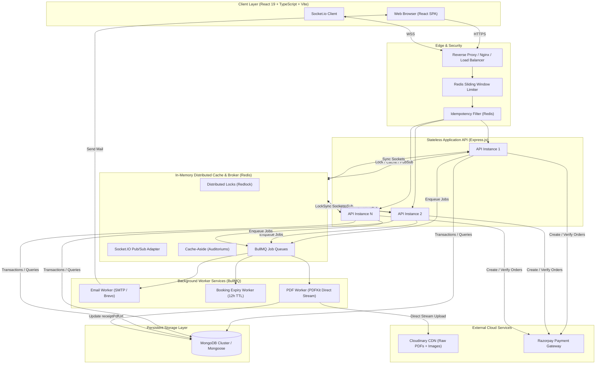
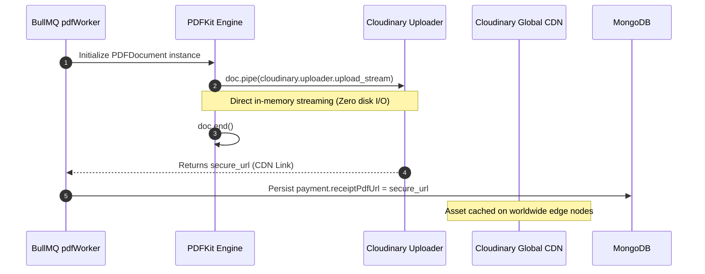
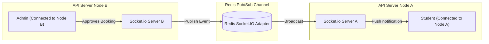
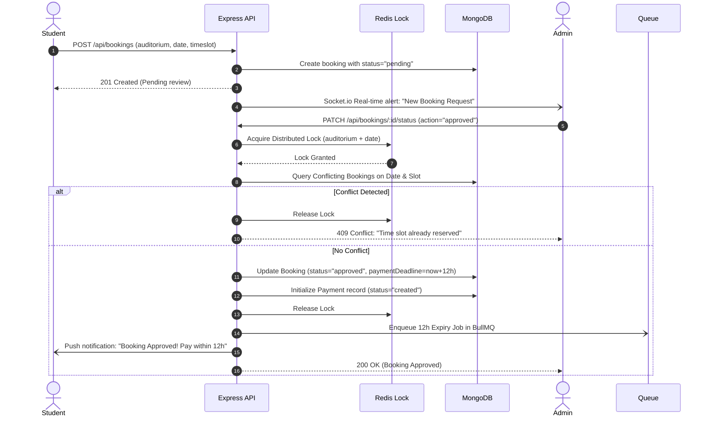
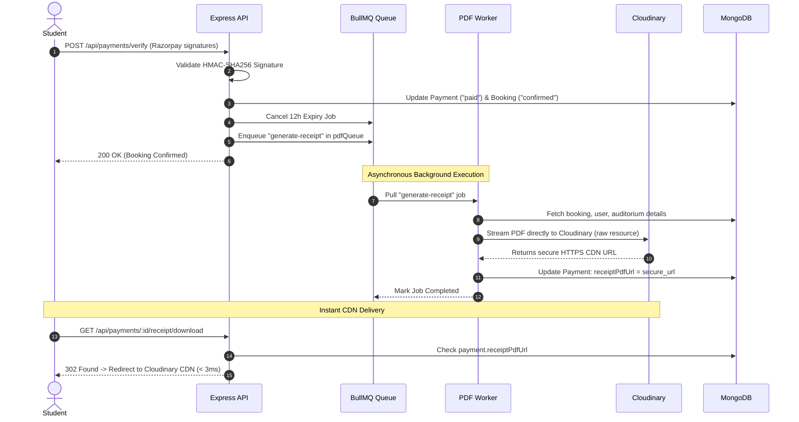
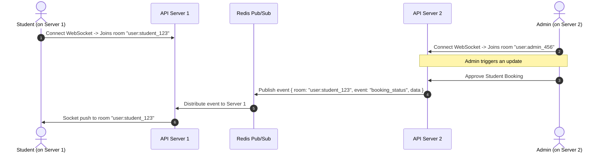

# 🏛️ AuditoReserve — System Architecture & Technical Design

Welcome to the comprehensive architecture specification for **AuditoReserve**. This document outlines the structural patterns, concurrency controls, asynchronous workflows, data pipelines, and distributed mechanisms engineered into the platform.

---

## 📌 Table of Contents

- [1. High-Level Architecture Overview](#1-high-level-architecture-overview)
- [2. Core Architectural Patterns](#2-core-architectural-patterns)
- [3. Subsystem Breakdown](#3-subsystem-breakdown)
  - [3.1 API Gateway & Security Pipeline](#31-api-gateway--security-pipeline)
  - [3.2 Distributed Concurrency & Locking (Redlock)](#32-distributed-concurrency--locking-redlock)
  - [3.3 Asynchronous Queue Processing (BullMQ)](#33-asynchronous-queue-processing-bullmq)
  - [3.4 Direct Stream Media & CDN Architecture](#34-direct-stream-media--cdn-architecture)
  - [3.5 Multi-Node Real-Time WebSockets (Redis Adapter)](#35-multi-node-real-time-websockets-redis-adapter)
  - [3.6 Data Layer & Persistence Topology](#36-data-layer--persistence-topology)
- [4. End-to-End Sequence Diagrams](#4-end-to-end-sequence-diagrams)
  - [4.1 Booking Request & Conflict Resolution](#41-booking-request--conflict-resolution)
  - [4.2 Payment Verification & Async Receipt Pipeline](#42-payment-verification--async-receipt-pipeline)
  - [4.3 Multi-Instance Real-Time Push Delivery](#43-multi-instance-real-time-push-delivery)
- [5. Reliability, Idempotency & Fault Tolerance](#5-reliability-idempotency--fault-tolerance)
- [6. Horizontal Scaling & Deployment Blueprint](#6-horizontal-scaling--deployment-blueprint)

---

## 1. High-Level Architecture Overview

AuditoReserve is designed around a **stateless, asynchronous, event-driven topology**. CPU-heavy and I/O-intensive workloads (PDF rendering, transactional emails, expiration scheduling) are completely isolated from HTTP request-response cycles.



---

## 2. Core Architectural Patterns

1. **Stateless Web Tier:** API nodes hold zero local state, sessions, or disk files. Any request can hit any backend container transparently.
2. **Event Loop Non-Blocking:** All computationally expensive operations (PDF document assembly, email rendering, delayed timeouts) are offloaded to BullMQ worker threads.
3. **Cache-Aside Pattern:** High-read queries (such as auditorium listings and venue details) are cached in Redis with automated cache invalidation on mutations and graceful fallback to MongoDB upon cache misses.
4. **Distributed Concurrency Guard:** Slot conflicts and booking approval states are mediated via distributed Redis locks to guarantee single-winner execution under high concurrent traffic.
5. **Direct Stream Ingestion:** Media assets (images and dynamically generated PDF receipts) stream straight into Cloudinary without touching local container disks.

---

## 3. Subsystem Breakdown

### 3.1 API Gateway & Security Pipeline

Every incoming HTTP request passes through a multi-tier pipeline:

```
[Request]
   │
   ▼
[Trust Proxy] ──► Configured for reverse proxy / load balancer transparency
   │
   ▼
[Helmet & CORS] ──► Strict security headers & whitelisted origin verification
   │
   ▼
[Redis Sliding Window Rate Limiter] ──► Prevents brute-force on auth & payment endpoints
   │
   ▼
[Idempotency Middleware] ──► Deduplicates mutation calls via `Idempotency-Key`
   │
   ▼
[JWT Authentication & Role Guard] ──► HttpOnly cookie + Bearer token resolution
   │
   ▼
[Controller Handler]
```

- **Sliding-Window Limiter:** Built using Redis Sorted Sets (`ZADD`, `ZREMRANGEBYSCORE`, `ZCARD`) to provide smooth rate limiting without boundary-reset vulnerabilities.
- **Idempotency Engine:** Caches payment verification responses using an idempotency key with a 24-hour TTL, safeguarding against double-charges caused by network retries.

---

### 3.2 Distributed Concurrency & Locking (Redlock)

In an auditorium reservation platform, multiple students or administrative staff may attempt to book, approve, or reschedule the same auditorium on identical dates or overlapping time slots.

```
       Request A (Approve Booking 1)          Request B (Approve Booking 2)
                     │                                      │
                     ▼                                      ▼
     [Acquire Lock: lock:booking:auditorium_id:date]
                     │
           ┌─────────┴─────────┐
           ▼                   ▼
     Lock Acquired        Lock Denied (409 Conflict)
           │                   │
     Verify DB Slots           └─► "Auditorium is currently being modified."
     Update Status
     Release Lock
```

- **Lock Scope:** `lock:booking:<auditoriumId>:<date>`
- **Safety Window:** Millisecond-level TTL with unique token verification upon release (`DEL` if value matches release token).
- **Conflict Engine:** Compares existing `confirmed` and `approved` bookings for same-day interval intersections:
  $$\text{Overlap} \iff (\text{Start}_A < \text{End}_B) \land (\text{End}_A > \text{Start}_B)$$

---

### 3.3 Asynchronous Queue Processing (BullMQ)

AuditoReserve operates three dedicated BullMQ queues backed by Redis:

| Queue Name | Primary Responsibility | Backoff Strategy | Job Deduplication |
| :--- | :--- | :--- | :--- |
| **`email-queue`** | Verification OTPs, booking confirmations, approval & cancellation alerts | Exponential, 5 retries | N/A |
| **`booking-expiry`** | Enforces the 12-hour payment deadline; auto-expires unpaid bookings | Delayed Job (12 hrs) | `jobId: booking_expire_<id>` |
| **`pdf-generation-queue`** | Generates PDFKit receipts and streams them directly to Cloudinary | Exponential, 3 retries (5s) | `jobId: receipt_<paymentId>` |

#### Worker Concurrency Management
- PDF worker concurrency is constrained to `2` to prevent memory and CPU exhaustion from heavy vector layout operations.
- Graceful shutdown handles `SIGINT` and `SIGTERM`, awaiting completion of active jobs before terminating connections.

---

### 3.4 Direct Stream Media & CDN Architecture

Generating PDFs traditionally consumes server disk space, risking disk exhaustion and failing in ephemeral container environments (e.g., Render, Railway, AWS ECS).



When users request a receipt download (`GET /api/payments/:bookingId/receipt/download`):
- **Fast Path:** Backend inspects `payment.receiptPdfUrl`. If present, it sends an immediate `302 Found` redirecting straight to the CDN edge.
- **Latency:** Less than **3ms** API processing time with **0% server CPU or streaming bandwidth consumed**.

---

### 3.5 Multi-Node Real-Time WebSockets (Redis Adapter)

To scale WebSocket connections across multiple load-balanced API servers, AuditoReserve implements `@socket.io/redis-adapter`.



- **User Room Registry:** Clients join private rooms keyed by `user:<userId>`.
- **Targeted Notifications:** Emitting to `io.to("user:" + recipientId).emit(...)` guarantees delivery irrespective of which server instance holds the client's WebSocket connection.

---

### 3.6 Data Layer & Persistence Topology

AuditoReserve utilizes **MongoDB** structured with schemas optimized for transactional integrity and rapid index-assisted queries.

```
┌──────────────────┐          ┌──────────────────┐
│       User       │          │   Auditorium     │
├──────────────────┤          ├──────────────────┤
│ _id              │          │ _id              │
│ name, email      │◄────┐    │ name, capacity   │◄────┐
│ role, department │     │    │ amenities        │     │
└──────────────────┘     │    │ images, price    │     │
                         │    └──────────────────┘     │
                         │                             │
                  ┌──────┴───────────┐                 │
                  │     Booking      │                 │
                  ├──────────────────┤                 │
                  │ _id              │                 │
                  │ user             │                 │
                  │ auditorium       ├─────────────────┘
                  │ date, startTime  │
                  │ endTime, status  │
                  │ paymentId        ├─────────┐
                  └──────────────────┘         │
                                               │
                                      ┌────────┴──────────┐
                                      │      Payment      │
                                      ├───────────────────┤
                                      │ _id, booking      │
                                      │ gatewayOrderId    │
                                      │ receipt           │
                                      │ receiptPdfUrl     │
                                      │ status, paidAt    │
                                      └───────────────────┘
```

#### Key Indexes:
- `booking.index({ auditorium: 1, bookingDate: 1, status: 1 })` — Ultra-fast conflict checks and availability searches.
- `payment.index({ booking: 1 })` — O(1) receipt and verification lookups.
- `payment.index({ status: 1, expiresAt: 1 })` — Rapid discovery of expired records.

---

## 4. End-to-End Sequence Diagrams

### 4.1 Booking Request & Conflict Resolution



---

### 4.2 Payment Verification & Async Receipt Pipeline



---

### 4.3 Multi-Instance Real-Time Push Delivery



---

## 5. Reliability, Idempotency & Fault Tolerance

1. **Idempotent Webhooks & Payments:** Every payment verification request requires an `Idempotency-Key` or relies on Razorpay `order_id` uniqueness. Duplicate attempts resolve instantly from cache.
2. **BullMQ Automatic Retries:** Network failures communicating with Cloudinary or SMTP hosts trigger an exponential backoff retry policy (3 to 5 attempts).
3. **Database Transactions:** Multi-document updates (such as updating Booking and creating Payment records) execute within MongoDB sessions to guarantee atomicity.
4. **Graceful Shutdown Protocol:** 
   - HTTP server stops accepting new connections.
   - Active BullMQ workers finish in-flight jobs.
   - BullMQ queues close connections cleanly.
   - Redis and MongoDB connection pools terminate.
   - 10-second watchdog timer prevents process hangs.

---

## 6. Horizontal Scaling & Deployment Blueprint

AuditoReserve is container-ready and structured for horizontal cloud scaling:

```
                          [ Internet Traffic ]
                                   │
                                   ▼
                         [ Cloudflare / Route 53 ]
                                   │
                                   ▼
                         [ Application Load Balancer ]
                                   │
            ┌──────────────────────┴──────────────────────┐
            ▼                                             ▼
  [ API Container Node 1 ]                      [ API Container Node 2 ]
  (Express / WebSockets)                        (Express / WebSockets)
            │                                             │
            ├──────────────────────┬──────────────────────┤
            │                      │                      │
            ▼                      ▼                      ▼
    [ Redis Cluster ]     [ MongoDB Replica Set ]   [ Worker Containers ]
    - Socket.io Adapter   - Primary (Writes)        - Dedicated BullMQ
    - Redlock & Caching   - Secondaries (Reads)       Workers (Email / PDF)
    - BullMQ Job Queues
```

### Key Scaling Recommendations:
- **Separate API and Worker Containers:** In production, run background workers in a distinct container (`npm run worker`) so that PDF vector rendering does not share CPU resources with Express HTTP listeners.
- **Redis High Availability:** Deploy Redis Sentinel or AWS ElastiCache for automated master-replica failover.
- **Read-Replica Offloading:** Route high-frequency listing queries to MongoDB secondary replicas with Redis cache-aside guarding all read routes.
