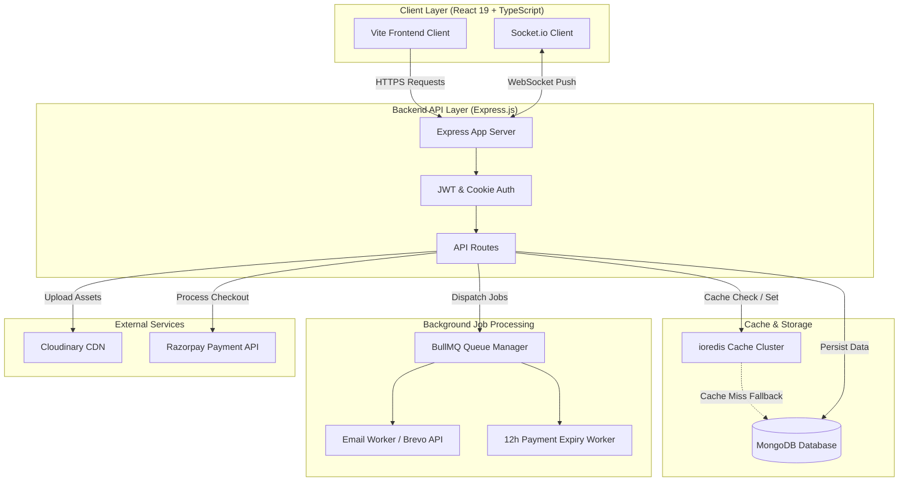

<div align="center">

  # 🏛️ AuditoReserve
  ### *Next-Generation Campus Auditorium Booking & Management Platform*

  [](https://opensource.org/licenses/ISC)
  [](https://nodejs.org/)
  [](https://react.dev/)
  [](https://www.typescriptlang.org/)
  [](https://tailwindcss.com/)
  [](https://www.mongodb.com/)
  [](https://redis.io/)
  [](https://bullmq.io/)
  [](https://razorpay.com/)

  <p align="center">
    <b>AuditoReserve</b> is an enterprise-grade, high-performance auditorium reservation system tailored for educational institutions. Designed with role-based workflows, real-time availability tracking, resilient caching, asynchronous job queues, and seamless online payment processing.
  </p>

</div>

---

## 📌 Table of Contents

- [✨ Key Features](#-key-features)
  - [👤 Student Experience](#-student-experience)
  - [🔑 Admin Management](#-admin-management)
  - [⚙️ Architecture \& Reliability](#️-architecture--reliability)
  - [🛡️ Enterprise Security](#️-enterprise-security)
- [🏗️ System Architecture](#️-system-architecture)
- [🛠️ Tech Stack](#️-tech-stack)
- [📂 Directory Structure](#-directory-structure)
- [⚙️ Environment Configuration](#️-environment-configuration)
- [🏁 Getting Started](#-getting-started)
- [🔌 API Reference](#-api-reference)
- [📄 License \& Author](#-license--author)

---

## ✨ Key Features

### 👤 Student Experience
- 📅 **Interactive Availability Calendar**: Visual month-view schedule displaying current bookings and daily slot allocations to prevent double-booking.
- 📝 **Intelligent Booking Requests**: Form validation with date/time collision detection before submission.
- 💳 **Razorpay Payment Gateway**: Instant, secure payment checkout for approved booking requests within a strict 12-hour window.
- 📆 **Calendar Integration**: Export approved bookings directly to **Google Calendar** or download standard **`.ics`** calendar files.
- 🔔 **Real-Time Push Notifications**: In-app WebSocket alert center delivering instant status updates (`Pending`, `Approved`, `Confirmed`, `Cancelled`).

### 🔑 Admin Management
- 🏢 **Auditorium Management (CRUD)**: Manage venue catalogs, capacity, equipment details, and image uploads powered by **Cloudinary**.
- 📑 **Booking Review Workflow**: Approve or reject student requests with custom notes and automated payment window initialization.
- 📊 **Analytics Dashboard**: High-level overview of venue utilization rates, total revenue generated, and booking trend distributions.

### ⚙️ Architecture & Reliability
- ⚡ **Resilient Redis Cache-Aside**: High-speed caching for auditorium catalogs with a **5-minute TTL**, auto-invalidation on updates, and transparent fallback to MongoDB on Redis downtime.
- 🔄 **Asynchronous BullMQ Workers**:
  - `email-queue`: Decouples transactional emails (verification, approvals, receipts, cancellations) via Brevo API out of the main request thread.
  - `booking-expiry`: Schedules a 12-hour delayed queue worker to automatically revoke unpaid approved bookings.
- 🌐 **Multi-Device WebSocket Registry**: Tracks active user connection IDs across multiple tabs/devices, dispatching targeted push updates and purging disconnected sockets on logout.
- 🛡️ **Graceful Shutdowns**: Node process intercepts `SIGINT`/`SIGTERM` to allow running BullMQ jobs and active database connections to close safely.

### 🛡️ Enterprise Security
- ✉️ **University Domain Locking**: Restricts user registration strictly to approved institutional email domains (e.g., `@tmu.ac.in`).
- 🔐 **HTTP-Only JWT Authentication**: Access and refresh tokens delivered in secure, HTTP-only, SameSite cookies to mitigate XSS exposure.
- 🛑 **Rate Limiting & Security Headers**: Integrated `express-rate-limit` on sensitive auth routes and `helmet` for HTTP security policies.

---

## 🏗️ System Architecture



---

## 🛠️ Tech Stack

### Backend Stack
| Domain | Technology | Description |
| :--- | :--- | :--- |
| **Runtime & Framework** | Node.js / Express.js | High-concurrency RESTful API server |
| **Database & ORM** | MongoDB / Mongoose | NoSQL document storage with schema validation |
| **Caching Layer** | Redis / ioredis | In-memory cache-aside pattern with TTL |
| **Task Queues** | BullMQ | Redis-backed asynchronous worker queues |
| **Real-time Engine** | Socket.io | Bi-directional WebSocket notification channel |
| **Payment Gateway** | Razorpay Node SDK | Transaction management & webhook processing |
| **Media & Mail** | Cloudinary / Nodemailer / Brevo | Cloud asset storage & API transactional emails |

### Frontend Stack
| Domain | Technology | Description |
| :--- | :--- | :--- |
| **UI Framework** | React 19 / TypeScript | Modern type-safe component architecture |
| **Build Tooling** | Vite / PostCSS | Blazing fast client-side bundler |
| **Styling & Motion** | Tailwind CSS v4 / Framer Motion | Design system & fluid micro-interactions |
| **Data & State** | TanStack React Query v5 | Server-state management, caching & polling |
| **Routing & Forms** | React Router v7 / React Hook Form + Zod | Dynamic client routing & schema form validation |
| **Icons** | Lucide React | Modern visual iconography |

---

## 📂 Directory Structure

```
Auditorium Booking System/
├── 📁 backend/
│   ├── 📁 src/
│   │   ├── 📁 config/        # Database, Redis, Cloudinary & Razorpay configs
│   │   ├── 📁 controllers/   # Auth, Auditorium, Booking & Payment logic
│   │   ├── 📁 middlewares/   # Auth, Rate limiting & Error handlers
│   │   ├── 📁 models/        # Mongoose database schemas
│   │   ├── 📁 queue/         # BullMQ queue producers
│   │   ├── 📁 routes/        # Express API endpoints
│   │   ├── 📁 service/      # Email & Cloudinary integration services
│   │   ├── 📁 utils/        # Socket registry & helper utilities
│   │   ├── 📁 worker/       # Asynchronous BullMQ background processors
│   │   ├── 📄 app.js        # Express app initialization & middleware stack
│   │   └── 📄 server.js     # Server bootstrap & WebSocket listener
│   └── 📄 package.json
│
└── 📁 frontend/
    ├── 📁 src/
    │   ├── 📁 api/          # Axios HTTP clients & endpoint definitions
    │   ├── 📁 components/   # Reusable UI components & modals
    │   ├── 📁 hooks/        # Custom React hooks (Auth, Sockets, Query)
    │   ├── 📁 pages/        # Student & Admin page views
    │   ├── 📁 types.ts      # TypeScript interface definitions
    │   ├── 📄 App.tsx       # Main router & app layout
    │   └── 📄 main.tsx      # Entry point & provider wrappers
    └── 📄 package.json
```

---

## ⚙️ Environment Configuration

To run AuditoReserve locally or in production, configure `.env` files in both `backend/` and `frontend/` directories.

### 🔑 Backend Configuration (`backend/.env`)

```env
# Server Setup
PORT=5000
NODE_ENV=development

# Database Connections
MONGODB_URI=mongodb://localhost:27017/auditoreserve
REDIS_HOST=127.0.0.1
REDIS_PORT=6379
REDIS_PASSWORD=

# Security & Domain Restrictions
JWT_ACCESS_SECRET=your_super_secret_access_key
JWT_REFRESH_SECRET=your_super_secret_refresh_key
UNIVERSITY_DOMAIN=tmu.ac.in

# Cloudinary Storage
CLOUDINARY_CLOUD_NAME=your_cloud_name
CLOUDINARY_API_KEY=your_api_key
CLOUDINARY_API_SECRET=your_api_secret

# Brevo Email API
BREVO_API_KEY=your_brevo_api_key
FROM_EMAIL=noreply@tmu.ac.in

# Razorpay Gateway
RAZORPAY_KEY_ID=your_razorpay_key_id
RAZORPAY_SECRET_KEY=your_razorpay_secret_key
```

### 💻 Frontend Configuration (`frontend/.env`)

```env
VITE_API_BASE_URL=http://localhost:5000/api
VITE_SOCKET_URL=http://localhost:5000
VITE_RAZORPAY_KEY_ID=your_razorpay_key_id
```

---

## 🏁 Getting Started

### 📋 Prerequisites
Ensure you have the following installed on your machine:
- **Node.js**: `v18.0.0` or higher
- **npm**: `v9.0.0` or higher
- **MongoDB**: Local server instance or MongoDB Atlas connection
- **Redis**: Local server instance or Redis Cloud instance

### ⚡ Installation & Setup

1. **Clone the Repository**
   ```bash
   git clone https://github.com/buildwithrishabh/AuditoReserve.git
   cd "Auditorium Booking System"
   ```

2. **Backend Setup**
   ```bash
   cd backend
   npm install
   # Create and configure your backend .env file
   npm run dev
   ```

3. **Frontend Setup**
   ```bash
   cd ../frontend
   npm install
   # Create and configure your frontend .env file
   npm run dev
   ```

4. **Access the Application**
   - **Frontend Client**: [http://localhost:5173](http://localhost:5173)
   - **Backend API Base**: [http://localhost:5000/api](http://localhost:5000/api)

---

## 🔌 API Reference

| Module | Method | Endpoint | Access | Description |
| :--- | :--- | :--- | :--- | :--- |
| **Auth** | `POST` | `/api/auth/register` | Public | Register user (restricted domain check) |
| **Auth** | `POST` | `/api/auth/login` | Public | Authenticate user & issue HTTP cookies |
| **Auth** | `POST` | `/api/auth/logout` | Authenticated | Invalidate refresh tokens & clear cookies |
| **Auth** | `GET` | `/api/auth/me` | Authenticated | Retrieve current session profile |
| **Auditorium** | `GET` | `/api/auditoriums` | Public | Fetch all auditoriums (Redis cached) |
| **Auditorium** | `POST` | `/api/auditoriums` | Admin | Create new auditorium entry with image |
| **Auditorium** | `PUT` | `/api/auditoriums/:id` | Admin | Update auditorium details & purge cache |
| **Booking** | `POST` | `/api/bookings` | Student | Submit booking request for an auditorium |
| **Booking** | `GET` | `/api/bookings/my-bookings` | Student | Get personal booking history |
| **Booking** | `PATCH` | `/api/bookings/:id/status` | Admin | Approve or reject booking request |
| **Payment** | `POST` | `/api/payments/create-order` | Student | Initialize Razorpay payment order |
| **Payment** | `POST` | `/api/payments/verify` | Student | Verify Razorpay payment signature |
| **Notifications**| `GET` | `/api/notifications` | Authenticated | Get in-app notification feed |

---

## 🤝 Contributing

Contributions are welcome! If you find any issues or have feature requests, feel free to open an issue or submit a pull request.

1. Fork the Project
2. Create your Feature Branch (`git checkout -b feature/AmazingFeature`)
3. Commit your Changes (`git commit -m 'Add some AmazingFeature'`)
4. Push to the Branch (`git checkout -b feature/AmazingFeature`)
5. Open a Pull Request

---

## 📄 License & Author

Distributed under the **ISC License**.

Developed with ❤️ by **Rishabh Kumar**  
🔗 **GitHub**: [@buildwithrishabh](https://github.com/buildwithrishabh)
