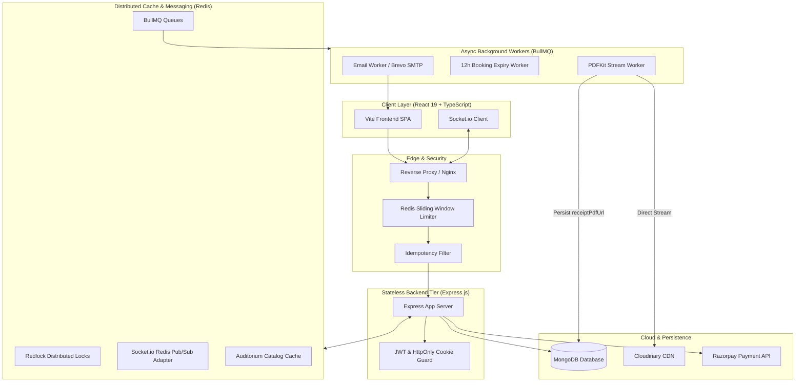

<div align="center">

  # 🏛️ AuditoReserve
  ### *Enterprise-Grade Campus Auditorium Reservation & Facility Management Platform*

  [](https://opensource.org/licenses/ISC)
  [](https://nodejs.org/)
  [](https://expressjs.com/)
  [](https://react.dev/)
  [](https://www.typescriptlang.org/)
  [](https://tailwindcss.com/)
  [](https://www.mongodb.com/)
  [](https://redis.io/)
  [](https://bullmq.io/)
  [](https://razorpay.com/)
  [](https://cloudinary.com/)

  <p align="center">
    <b>AuditoReserve</b> is a modern, high-performance auditorium booking platform built for university campuses. Designed with role-based workflows, distributed concurrency control, real-time multi-node synchronization, asynchronous background queues, and instant CDN-delivered PDF receipts.
  </p>

  <p align="center">
    <a href="#-key-features">Key Features</a> •
    <a href="#-system-architecture">System Architecture</a> •
    <a href="#-tech-stack">Tech Stack</a> •
    <a href="#-getting-started">Getting Started</a> •
    <a href="#-api-endpoints">API Reference</a> •
    <a href="./ARCHITECTURE.md">Deep-Dive Architecture ↗</a>
  </p>

</div>

---

## 📖 Overview

University auditoriums are high-demand shared resources susceptible to scheduling conflicts, unconfirmed slot hoarding, and administrative overhead. **AuditoReserve** solves this by providing:

1. **Conflict-Free Reservations:** Powered by **Redis-backed distributed locks (Redlock)** to eliminate double-booking race conditions during concurrent approval windows.
2. **Asynchronous Heavy Processing:** PDF receipt generation, email dispatches, and 12-hour unpaid slot expirations are completely offloaded to background **BullMQ** workers.
3. **Instant CDN Delivery:** Computer-generated PDF receipts stream directly into **Cloudinary** via Node.js streams (zero local disk I/O) and are served via instant `302 Redirects` (< 3ms response).
4. **Horizontal Scalability:** Stateless Express servers paired with `@socket.io/redis-adapter` for multi-instance WebSocket synchronization across distributed server nodes.

> 💡 **Looking for low-level architecture designs, concurrency flowcharts, and sequence diagrams?**  
> Check out the [Comprehensive Architecture Specification (ARCHITECTURE.md)](./ARCHITECTURE.md).

---

## ✨ Key Features

### 🎓 Student Experience
- 📅 **Interactive Visual Calendar:** Month-view calendar displaying real-time booking statuses and booked time slots.
- 📝 **Collision-Guarded Booking Requests:** Real-time client & server validation checking for date/time overlaps before submission.
- 💳 **Seamless Razorpay Integration:** Secure payments for approved bookings within a strictly enforced 12-hour payment window.
- 🧾 **Instant PDF Invoices:** Direct download and inline preview of verified payment receipts powered by Cloudinary CDN.
- 🔔 **Live Push Alerts:** In-app real-time notifications via WebSockets on booking approvals, rejections, and payment confirmations.
- 📆 **Calendar Sync:** One-click export to Google Calendar and `.ics` files.

### 🛡️ Administrative Control
- 🏢 **Venue Management (CRUD):** Catalog halls, capacities, amenities, base pricing, and multi-image uploads to Cloudinary.
- 📑 **Booking Review Workflow:** Approve or reject student applications with collision detection and automated 12-hour payment timers.
- 📊 **Analytics & Metrics:** Operational dashboard providing utilization rates, revenue analytics, and upcoming reservation feeds.
- ⚡ **Automated Slot Expiration:** Auto-releases approved bookings back to available inventory if payment is not received within 12 hours.

### ⚙️ Core Platform & Engineering
- 🔒 **Distributed Concurrency Guard:** Redlock implementation prevents two admins or students from claiming or approving colliding slots simultaneously.
- ⚡ **Resilient Cache-Aside Pattern:** Redis caching for auditorium catalogs with automated cache invalidation upon updates.
- 🔄 **3 Dedicated BullMQ Worker Queues:**
  - `email-queue`: Asynchronous transactional emails (verification, approval, cancellations).
  - `booking-expiry-queue`: 12-hour delayed timer enforcing payment deadlines.
  - `pdf-generation-queue`: Direct stream PDF rendering and cloud CDN synchronization.
- 🌐 **Multi-Instance WebSocket Adapter:** Redis Pub/Sub backplane ensures notifications reach users across load-balanced API nodes.
- 🛡️ **Graceful Process Shutdown:** Intercepts `SIGINT`/`SIGTERM` to allow running BullMQ jobs and active DB connections to terminate safely.

---

## 🏗️ System Architecture


```mermaid
flowchart TD
    subgraph Client ["Client Layer (React 19 + TypeScript)"]
        UI[Vite Frontend SPA]
        WS[Socket.io Client]
    end

    subgraph Gateway ["Edge & Security"]
        Proxy[Reverse Proxy / Nginx]
        Limiter[Redis Sliding Window Limiter]
        Idempotent[Idempotency Filter]
    end

    subgraph API ["Stateless Backend Tier (Express.js)"]
        Server[Express App Server]
        Auth[JWT & HttpOnly Cookie Guard]
    end

    subgraph State ["Distributed Cache & Messaging (Redis)"]
        Lock[Redlock Distributed Locks]
        Adapter[Socket.io Redis Pub/Sub Adapter]
        Queues[BullMQ Queues]
        Cache[Auditorium Catalog Cache]
    end

    subgraph Workers ["Async Background Workers (BullMQ)"]
        EmailW[Email Worker / Brevo SMTP]
        ExpiryW[12h Booking Expiry Worker]
        PDFW[PDFKit Stream Worker]
    end

    subgraph Storage ["Cloud & Persistence"]
        DB[(MongoDB Database)]
        Cloud[Cloudinary CDN]
        Razorpay[Razorpay Payment API]
    end

    UI --> Proxy
    WS <--> Proxy
    Proxy --> Limiter --> Idempotent --> Server
    Server --> Auth
    Server <--> State
    Server --> DB
    Server --> Razorpay
    Queues --> Workers
    PDFW -->|Direct Stream| Cloud
    PDFW -->|Persist receiptPdfUrl| DB
    EmailW --> UI
```

---

## 🛠️ Tech Stack

### Backend Stack
| Layer | Technologies | Purpose |
| :--- | :--- | :--- |
| **Runtime & Server** | Node.js (v18+) • Express.js 4.21 | High-concurrency asynchronous REST API |
| **Primary Database** | MongoDB • Mongoose 9.6 | Document database with schema validation & compound indexes |
| **In-Memory Store** | Redis • ioredis 5.10 | Cache-aside, distributed locks, rate limiting, and BullMQ backend |
| **Job Queues** | BullMQ 5.78 | Redis-backed asynchronous worker queues with exponential retries |
| **Real-time Engine** | Socket.io 4.8 • `@socket.io/redis-adapter` | Bi-directional multi-node WebSocket communication |
| **PDF Generation** | PDFKit 0.20 | Programmatic, high-resolution vector PDF receipt creation |
| **Media & CDN** | Cloudinary SDK • Multer Storage | Cloud image hosting & direct raw PDF stream storage |
| **Payments** | Razorpay Node SDK 2.9 | Order creation, HMAC-SHA256 signature verification |
| **Logging & Security** | Winston 3.19 • Helmet • Morgan | Structured JSON logging & hardened HTTP security headers |

### Frontend Stack
| Layer | Technologies | Purpose |
| :--- | :--- | :--- |
| **UI Framework** | React 19 • TypeScript 6.0 | Modern type-safe component architecture |
| **Build & Bundler** | Vite 8.0 • PostCSS | High-speed HMR development & optimized production bundles |
| **Styling & Motion** | Tailwind CSS v4 • Framer Motion | Modern design system & micro-interactions |
| **Server State** | TanStack React Query v5 | Data fetching, automated caching & optimistic updates |
| **Forms & Validation** | React Hook Form • Zod 4.4 | Schema-driven client-side form validation |
| **Icons & UI** | Lucide React | Lightweight vector iconography |

---

## 📂 Directory Structure

```
Auditorium Booking System/
├── 📄 ARCHITECTURE.md          # Comprehensive architectural & sequence documentation
├── 📄 README.md                # Project overview and quickstart guide
│
├── 📁 backend/
│   ├── 📁 src/
│   │   ├── 📁 config/          # Database, Redis, Cloudinary, Razorpay & Winston
│   │   ├── 📁 controllers/     # Auth, Auditorium, Booking, and Payment handlers
│   │   ├── 📁 middlewares/     # JWT, Role Guard, Idempotency, Rate Limiter
│   │   ├── 📁 models/          # User, Auditorium, Booking, Payment Mongoose schemas
│   │   ├── 📁 queue/           # BullMQ queue producers (Email, Expiry, PDF)
│   │   ├── 📁 routes/          # Express route definitions
│   │   ├── 📁 utils/           # Cloudinary helpers, PDFKit receipt generator
│   │   ├── 📁 worker/          # BullMQ background workers (email, expiry, pdf)
│   │   ├── 📄 app.js           # Express app configuration & middleware pipeline
│   │   └── 📄 server.js        # Server bootstrap, Socket.io & graceful shutdown
│   ├── 📄 Dockerfile           # Multi-stage production container image
│   ├── 📄 docker-compose.yml   # Backend, MongoDB & Redis container orchestration
│   ├── 📄 .dockerignore        # Build context ignore rules
│   └── 📄 package.json
│
└── 📁 frontend/
    ├── 📁 src/
    │   ├── 📁 api/             # Axios API client & endpoints
    │   ├── 📁 components/      # Reusable UI widgets, modals, layout cards
    │   ├── 📁 hooks/           # Custom hooks (Auth, WebSocket, React Query)
    │   ├── 📁 pages/           # Student & Admin page views
    │   ├── 📄 App.tsx          # React Router v7 navigation tree
    │   └── 📄 main.tsx         # Client root & React Query Provider
    └── 📄 package.json
```

---

## ⚙️ Environment Configuration

Create `.env` configuration files in both `backend/` and `frontend/` directories:

### 🔑 Backend (`backend/.env`)

```env
PORT=5000
NODE_ENV=development
FRONTEND_URL=http://localhost:5173

# Database & Cache
MONGODB_URI=mongodb://localhost:27017/auditoreserve
REDIS_HOST=127.0.0.1
REDIS_PORT=6379
REDIS_PASSWORD=

# Security & Domain Restrictions
JWT_ACCESS_SECRET=your_super_secret_access_jwt_key
JWT_REFRESH_SECRET=your_super_secret_refresh_jwt_key
UNIVERSITY_DOMAIN=tmu.ac.in

# Cloudinary Storage
CLOUDINARY_CLOUD_NAME=your_cloudinary_cloud_name
CLOUDINARY_API_KEY=your_cloudinary_api_key
CLOUDINARY_API_SECRET=your_cloudinary_api_secret

# Email Gateway (SMTP / Brevo)
EMAIL_HOST=smtp-relay.brevo.com
EMAIL_PORT=587
EMAIL_USER=your_smtp_user
EMAIL_PASS=your_smtp_password
FROM_EMAIL=noreply@tmu.ac.in
FROM_NAME="AuditoReserve Administration"

# Razorpay Gateway
RAZORPAY_KEY_ID=your_razorpay_key_id
RAZORPAY_KEY_SECRET=your_razorpay_key_secret
```

### 💻 Frontend (`frontend/.env`)

```env
VITE_API_BASE_URL=http://localhost:5000/api
VITE_SOCKET_URL=http://localhost:5000
VITE_RAZORPAY_KEY_ID=your_razorpay_key_id
```

---

## 🏁 Getting Started

### 📋 Prerequisites
- **Node.js**: `v18.0.0` or higher
- **npm**: `v9.0.0` or higher
- **MongoDB**: Local MongoDB community instance or MongoDB Atlas URI (or run via Docker)
- **Redis**: Local server instance or Redis Cloud instance (or run via Docker)
- **Docker & Docker Compose**: (Optional, for containerized backend & databases)

### 🐳 Running Backend with Docker (Recommended for Backend)
You can launch the backend service alongside dedicated **MongoDB 7** and **Redis 7** containers with health checks and persistent volumes with a single command:

```bash
# 1. Navigate to backend directory
cd backend

# 2. Build and start MongoDB, Redis, and Backend API in detached mode
docker compose up -d --build

# 3. Verify running containers and health checks
docker compose ps

# 4. View live logs from the backend service
docker compose logs -f backend
```
* **Backend Health Check:** [http://localhost:5000/api/health](http://localhost:5000/api/health)

To stop the backend stack:
```bash
docker compose down
```

---

### ⚡ Manual Local Development Setup

1. **Clone the repository**
   ```bash
   git clone https://github.com/buildwithrishabh/AuditoReserve.git
   cd "Auditorium Booking System"
   ```

2. **Start Backend Service**
   ```bash
   cd backend
   npm install
   # Ensure backend/.env is populated
   npm run dev
   ```

3. **Start Frontend Client**
   ```bash
   cd ../frontend
   npm install
   # Ensure frontend/.env is populated
   npm run dev
   ```

4. **Verify Running Application**
   - **Frontend UI:** [http://localhost:5173](http://localhost:5173)
   - **Backend Health Check:** [http://localhost:5000/api/health](http://localhost:5000/api/health)

---

## 🔌 API Endpoints

### 🔐 Authentication (`/api/auth`)
| Method | Endpoint | Access | Description |
| :--- | :--- | :--- | :--- |
| `POST` | `/api/auth/register` | Public | Register new user (domain verified) |
| `POST` | `/api/auth/login` | Public | Authenticate user & issue HttpOnly JWT |
| `POST` | `/api/auth/logout` | Authenticated | Revoke refresh token & purge cookies |
| `GET` | `/api/auth/me` | Authenticated | Retrieve authenticated user profile |

### 🏛️ Auditoriums (`/api/auditoriums`)
| Method | Endpoint | Access | Description |
| :--- | :--- | :--- | :--- |
| `GET` | `/api/auditoriums` | Public | List all venues (Redis cached) |
| `GET` | `/api/auditoriums/:id` | Public | Get single auditorium details |
| `POST` | `/api/auditoriums` | Admin | Create venue with Cloudinary photos |
| `PUT` | `/api/auditoriums/:id` | Admin | Update venue & invalidate cache |
| `DELETE`| `/api/auditoriums/:id` | Admin | Remove venue & purge associated cache |

### 📅 Bookings (`/api/bookings`)
| Method | Endpoint | Access | Description |
| :--- | :--- | :--- | :--- |
| `POST` | `/api/bookings` | Student | Submit booking reservation request |
| `GET` | `/api/bookings/my-bookings`| Student | Get personal bookings (with pagination) |
| `GET` | `/api/bookings` | Admin | List all requests with status filters |
| `PATCH`| `/api/bookings/:id/status` | Admin | Approve/Reject request (Redlock protected) |
| `DELETE`| `/api/bookings/:id` | Student/Admin | Cancel pending/approved reservation |

### 💳 Payments & Receipts (`/api/payments`)
| Method | Endpoint | Access | Description |
| :--- | :--- | :--- | :--- |
| `POST` | `/api/payments/create-order/:bookingId` | Student | Create Razorpay order |
| `POST` | `/api/payments/verify` | Student | Verify payment signature & confirm booking |
| `GET` | `/api/payments/:bookingId/receipt` | Authenticated | Fetch receipt JSON / inline PDF |
| `GET` | `/api/payments/:bookingId/receipt/download` | Authenticated | Instant 302 redirect to Cloudinary CDN PDF |

### 🔔 Notifications (`/api/notifications`)
| Method | Endpoint | Access | Description |
| :--- | :--- | :--- | :--- |
| `GET` | `/api/notifications` | Authenticated | Fetch user notification feed |
| `PATCH`| `/api/notifications/:id/read` | Authenticated | Mark notification as read |

---

## 🤝 Contributing

Contributions are welcome! Please follow these steps:
1. Fork the repository
2. Create your feature branch (`git checkout -b feature/AmazingFeature`)
3. Commit your changes (`git commit -m 'feat: Add AmazingFeature'`)
4. Push to the branch (`git push origin feature/AmazingFeature`)
5. Open a Pull Request

---

## 📄 License & Author

Distributed under the **ISC License**.

Created & Maintained with ❤️ by **Rishabh Kumar**  
- **GitHub:** [@buildwithrishabh](https://github.com/buildwithrishabh)
