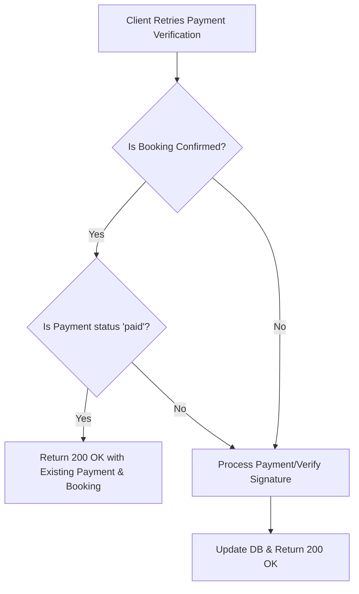

# 🔑 Complete Guide: Implementing Payment Idempotency

This guide explains the concept of **Idempotency** in payment systems and shows how to implement it within the Auditorium Booking System codebase.

---

## 💡 What is Idempotency?

An API endpoint is **idempotent** if making multiple identical requests has the same effect as making a single request. 

In payment gateways, idempotency prevents users from being double-charged due to:
1. **Client Retries:** A student clicks "Pay Now" twice because of UI lag.
2. **Network Failures:** The payment was successful on the gateway, but the connection dropped before the backend could save the result. The client retries the verification request.
3. **Webhook Retries:** Payment gateways (like Razorpay) retry webhooks if they receive a non-200 response from your server.

---

## 🛠️ The 2-Tier Idempotency Plan for Our Project

To achieve true payment safety, we will implement idempotency in two areas:
1. **Razorpay Order Creation:** Prevent duplicate orders inside Razorpay.
2. **Payment Verification:** Return a successful response on retried payment verifications instead of a `400 Bad Request`.



---

## 📝 Implementation Details

### Phase 1: Razorpay Order Creation Idempotency
Razorpay allows you to pass an `x-idempotency-key` in the API request headers. If you send the same key again with the same parameters, Razorpay returns the existing order instead of creating a new one.

#### Current Code:
```javascript
const razorpayOrder = await razorpayClient.orders.create({
  amount: booking.totalPrice * 100,
  currency: "INR",
  receipt,
  notes: { bookingId: booking._id.toString() },
});
```

#### Idempotent Implementation:
We will pass the booking ID and receipt hash as the `x-idempotency-key` in the request options (second argument to `.create`):

```javascript
const razorpayOrder = await razorpayClient.orders.create(
  {
    amount: booking.totalPrice * 100,
    currency: "INR",
    receipt,
    notes: {
      bookingId: booking._id.toString(),
      userId: req.user.id,
    },
  },
  {
    // Razorpay uses this header to deduplicate requests within a 24-hour window
    headers: {
      "x-idempotency-key": `order_init_${booking._id.toString()}`,
    }
  }
);
```

---

### Phase 2: Payment Verification Idempotency
In [`paymentController.js`](file:///d:/Backend/Backend%20Projects/Auditorium%20Booking%20System/backend/src/controllers/paymentController.js), if we receive a retry request for a booking that is already confirmed and paid, we should return a success response immediately instead of throwing a `400 Bad Request` ("This booking is not awaiting payment").

#### Current Implementation (Throws Error):
```javascript
if (booking.status !== "approved") {
  return res.status(400).json({
    success: false,
    message: "This booking is not awaiting payment",
  });
}
```

#### Idempotent Implementation (Safe Retry):
We will inspect if the booking is already `"confirmed"` and the corresponding payment is already `"paid"`. If yes, we return a `200 OK` directly.

```javascript
// Check if payment is already completed (Idempotent response)
if (booking.status === "confirmed") {
  const existingPayment = await Payment.findById(booking.paymentId);
  if (existingPayment && existingPayment.status === "paid") {
    return res.status(200).json({
      success: true,
      message: "Payment already processed and verified successfully.",
      booking,
      payment: existingPayment,
    });
  }
}

// Fallback logic for invalid non-approved requests
if (booking.status !== "approved") {
  return res.status(400).json({
    success: false,
    message: "This booking is not awaiting payment",
  });
}
```

---

## 🚀 How to Implement This in Your Code

Here are the precise changes you need to make to [`paymentController.js`](file:///d:/Backend/Backend%20Projects/Auditorium%20Booking%20System/backend/src/controllers/paymentController.js).

### Step 1: Update `createPaymentOrder` (Razorpay Idempotency)
Find the `razorpayClient.orders.create` call (around line 55) and add the headers parameter:

```javascript
      const razorpayOrder = await razorpayClient.orders.create({
        amount: booking.totalPrice * 100,
        currency: "INR",
        receipt,
        notes: {
          bookingId: booking._id.toString(),
          userId: req.user.id,
        },
      }, {
        headers: {
          "x-idempotency-key": `order_init_${booking._id.toString()}`,
        }
      });
```

### Step 2: Update `verifyPayment` (Verification Idempotency)
Find the `booking.status !== "approved"` check (around line 118) and replace it with:

```javascript
    // 1. Idempotency Check: If already confirmed and paid, return success directly
    if (booking.status === "confirmed") {
      const existingPayment = await Payment.findById(booking.paymentId);
      if (existingPayment && existingPayment.status === "paid") {
        return res.status(200).json({
          success: true,
          message: "Payment verified successfully (Idempotent retry).",
          booking,
          payment: existingPayment,
        });
      }
    }

    // 2. Reject if the status isn't approved for payment
    if (booking.status !== "approved") {
      return res.status(400).json({
        success: false,
        message: "This booking is not awaiting payment",
      });
    }
```

---

## 📊 Verification Checklist

| Scenario | Before Idempotency | After Idempotency | Expected Result |
| :--- | :--- | :--- | :--- |
| Student double-clicks "Pay" button | Two separate Razorpay Orders could trigger | Single order returned by Razorpay | Student only sees one transaction checkout screen |
| Success call succeeds, network drops, client retries `/verify-payment` | Server returns `400 Bad Request` (Frontend shows error) | Server returns `200 Success` | Client UI shows booking confirmed without error popup |
| Admin modifies booking and student tries to verify old payment | Server returns `400 Bad Request` | Server returns `400 Bad Request` | Protected transaction security |
