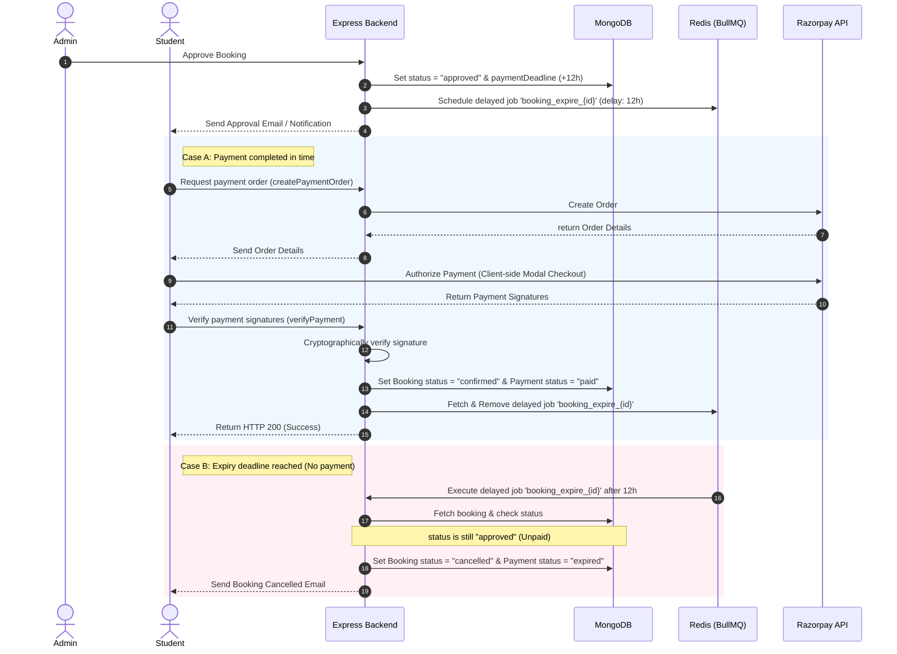

# 💳 Razorpay Payment & Expiry Workflow Documentation

This document describes the end-to-end payment flow, scheduled expiration checks, and the integration of **Razorpay Gateway** and **BullMQ** in the Auditorium Booking System.

---

## 📅 System Architecture Overview

The booking payment process operates on a **12-hour strict deadline window**. If the booking is approved by the admin, the student has 12 hours to complete the payment. If the payment is not completed, background workers automatically release the reservation.



---

## 🛠️ Step-by-Step Flow Details & Code Snippets

### 1. Booking Approval & Job Scheduling
When an admin approves a booking, the deadline is set to `Date.now() + 12 hours`, and a delayed job is scheduled in the `booking-expiry` queue with a unique `jobId`.

* **Files involved:**
  * Controller: [`bookingController.js`](file:///d:/Backend/Backend%20Projects/Auditorium%20Booking%20System/backend/src/controllers/bookingController.js)

```javascript
// From bookingController.js
booking.status = "approved";
booking.approvedAt = approvedAt;
booking.paymentDeadline = paymentDeadline;
booking.paymentId = payment._id;
await booking.save();

// Schedule a 12-hour delayed expiration job
const delayMs = 12 * 60 * 60 * 1000;
await bookingExpiryQueue.add(
  `expire_${booking._id}`,
  { bookingId: booking._id },
  {
    delay: delayMs,
    jobId: `booking_expire_${booking._id}`, // Trackable Job ID
  },
);
```

---

### 2. Initiating Payment Order
When the student triggers checkout, the backend initiates a Razorpay order. It reuses existing details to guarantee idempotency and avoid creating multiple orders for a single booking request.

* **Files involved:**
  * Controller: [`paymentController.js`](file:///d:/Backend/Backend%20Projects/Auditorium%20Booking%20System/backend/src/controllers/paymentController.js)

```javascript
// From paymentController.js -> createPaymentOrder
let payment = await Payment.findById(booking.paymentId);

// Idempotent check: If payment order doesn't exist, create it.
if (!payment) {
  const receipt = `bk_${booking._id.toString().slice(-16)}_${Date.now()}`;
  const razorpayOrder = await razorpayClient.orders.create({
    amount: booking.totalPrice * 100, // Amount in paise
    currency: "INR",
    receipt,
    notes: {
      bookingId: booking._id.toString(),
      userId: req.user.id,
    },
  });

  payment = await Payment.create({
    user: req.user.id,
    booking: booking._id,
    amount: booking.totalPrice,
    currency: "INR",
    gatewayOrderId: razorpayOrder.id,
    status: "created",
    receipt,
    expiresAt: booking.paymentDeadline,
  });

  booking.paymentId = payment._id;
  await booking.save();
}
```

---

### 3. Payment Verification & Queue Clean-up
Once the student pays via the client-side checkout modal, the client submits the verification signatures. The backend cryptographically validates the payment signature. If correct, the booking is confirmed, and the scheduled expiration job is deleted from Redis to preserve resources.

* **Files involved:**
  * Controller: [`paymentController.js`](file:///d:/Backend/Backend%20Projects/Auditorium%20Booking%20System/backend/src/controllers/paymentController.js)

```javascript
// From paymentController.js -> verifyPayment
const expectedSignature = crypto
  .createHmac("sha256", process.env.RAZORPAY_SECRET_KEY)
  .update(`${razorpay_order_id}|${razorpay_payment_id}`)
  .digest("hex");

if (expectedSignature !== razorpay_signature) {
  await Payment.findOneAndUpdate(
    { gatewayOrderId: razorpay_order_id },
    { status: "failed", failureReason: "Invalid Razorpay signature" },
  );
  return res.status(400).json({ success: false, message: "Invalid payment signature" });
}

// Update payment and booking statuses
const payment = await Payment.findOneAndUpdate(
  { gatewayOrderId: razorpay_order_id },
  {
    gatewayPaymentId: razorpay_payment_id,
    gatewaySignature: razorpay_signature,
    status: "paid",
    paidAt: new Date(),
  },
  { new: true },
);

booking.status = "confirmed";
booking.paymentId = payment._id;
await booking.save();

// --- QUEUE CLEANUP ---
// Since payment is successful, delete the scheduled 12-hour expiry job to save Redis memory & CPU.
try {
  const jobId = `booking_expire_${booking._id}`;
  const job = await bookingExpiryQueue.getJob(jobId);
  if (job) {
    await job.remove();
    console.log(`[Payment] Expiry Job ${jobId} successfully removed from queue`);
  }
} catch (queueError) {
  // Graceful handling to prevent client API 500 crashes due to Redis network glitches
  console.error(`[Payment] Failed to remove expiry job: ${queueError.message}`);
}
```

---

## 🗄️ Database Schemas Reference

### Booking Schema Fields (`booking.js`)
* `status`: `["pending", "approved", "confirmed", "cancelled"]` (Awaiting admin approval -> approved/waiting payment -> paid/confirmed -> cancelled on failure/expiry).
* `paymentDeadline`: Date (Approved Timestamp + 12 Hours).
* `paymentId`: Reference to the `Payment` document.

### Payment Schema Fields (`payment.js`)
* `status`: `["created", "paid", "failed", "expired"]` (Initialized -> Verified -> Signature Failed -> 12 hours timeout).
* `gatewayOrderId`: Razorpay generated Order ID (`order_...`).
* `gatewayPaymentId`: Razorpay transaction transaction ID (`pay_...`).
